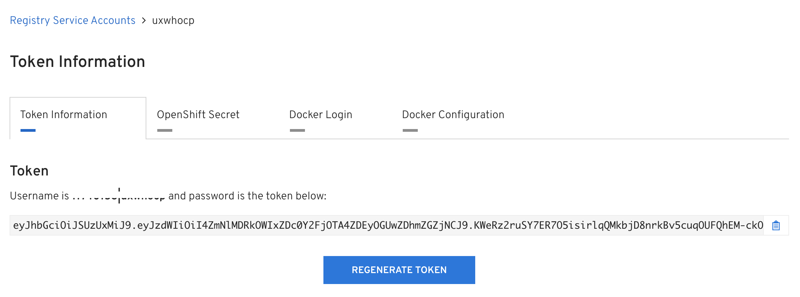

In OCP 3.11, the registry has changed to registry.redhat.io. This registry requires a login and will not function correctly without one. This means that you won't make it through an installation until you create a login and feed it to Openshift.

In order to facilite this, the following things need to be done.

- Create a service account at the RH Registry Service Account site : https://access.redhat.com/terms-based-registry
- Add this account to the ansible inventory used to install OCP.
- Login to this registry with Docker, just in case. :)

More information on registry configuration can be found in the 3.11 documentation [here](https://docs.openshift.com/container-platform/3.11/install/configuring_inventory_file.html#advanced-install-configuring-registry-location)

**Note** : My testing has shown that I don't need to build a secret in OCP as seen on the portal site as it seems to be done accordingly by the installer. If that is not the case, please open up an issue.

**Examples** :

Login to the aforementioned site and create a token. The site will combine the account and the token name you give it. The following screenshot shows an example of a created token.



Now add the registry URL, username, and token to your Ansible inventory. There is an example in this repository called [inventory.fragment.registry](inventory.fragment.registry)

```` ansible
# Registry : redhat.io
oreg_url=registry.redhat.io/openshift3/ose-${component}:${version}
oreg_auth_user=11111111|uxwhocp
oreg_auth_password=1234567890abcdefgp94hrp93984fhe8rg09q438htaQUG(EA%(GJA$fja489gqu4i90q3t4j9aj90g#Q$Q#$(T)GGK#Q$)TQK@EPKjr98q3u4t90gaue09[gqp054p3jt09q3i48t9	24jf9r8gij98w4iyq45789iwhrgi9qu35tQ%#TY)#Q%TQJG)Q#%YIQ#%)UY8q34tq039giq094u5yj8qu935tjq093gjqo95yijw590uhjge09jw459pyj409w4j0gq5jhg90q45jy9w45io8r6a[0E%py,Q#T(Q(VT(iearp9gq3i40tiuw509hjw49yi34qj9gjha90pojq0935jy0q39jg09aeu5y09pq3uj5yp09qu5rp9oyujw4o59utp9845wuqgjqw89o4i5u6oq8taiuegqwp049asep5ht09q5hwt9t8auyh9p8qgo8ua4pt0oq435a98z85l68qp[3aoe7t19p57y0-p19284q509y842w5YQ!%IYQ#%($%^Y@$(W%TI@Q$W^%)HIQ$%YIQ$%YI)HQW$^KTHA)UITIyquj58oguqp08957uyt;24w0u5p<F9>tuh945aeYHQ$AEYH(Q5rh8oaeijy9qj45pyoq4a5p9euyq;9puyp9/q45uy9q4u9p5yuq95ypu9jga;OP9UY3Q59GU90P889e5ug89w495gj8950gjw495hjw4oejhg98j9045gW%W$()%Y$)G$K#%)YQ#%JYQJ)%H35
````
