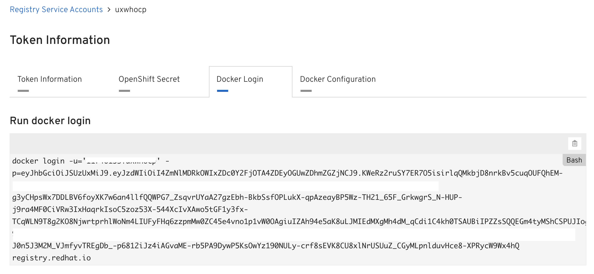

## OCP 3.11 Registry Updates

In OCP 3.11, the registry has changed to _registry.redhat.io_. This registry requires a login and you won't make it through an OCP 3.11 installation until you create a login and feed it to Openshift.

In order to facilitate this, the following things need to be done.

- Create a service account at the RH Registry Service Account site : https://access.redhat.com/terms-based-registry
- Add this account to the Ansible inventory used to install OCP.
- Login to this registry with Docker, just in case. :)

More information on registry configuration can be found in the 3.11 documentation [here](https://docs.openshift.com/container-platform/3.11/install/configuring_inventory_file.html#advanced-install-configuring-registry-location)

Additional information on the Red Hat Container Registries can be found at  https://access.redhat.com/RegistryAuthentication

Additional troubleshooting steps for the registry can be found at https://access.redhat.com/articles/3560571

**Note** : My testing has shown that I didn't need to build a secret in OCP after installation as seen on the portal site as it seems to be done accordingly by the installer. If anyone sees different results, let me know.

## Examples

##### Ansible Inventory

Login to the aforementioned site and create a token. The site will combine the account and the token name you give it. The following screenshot shows an example of a created token.


Now add the registry URL, username, and token to your Ansible inventory. There is an example in this repository called [inventory.fragment.registry](inventory.fragment.registry)

```
# Registry : redhat.io
oreg_auth_user=11111111|uxwhocp
oreg_auth_password=1234567890abcdefgp94hrp93984fhe8rg09q438htaQUG(EA%(GJA$fja489gqu4i90q3t4j9aj90g#Q$Q#$(T)GGK#Q$)TQK@EPKjr98q3u4t90gaue09[gqp054p3jt09q3i48t9	24jf9r8gij98w4iyq45789iwhrgi9qu35tQ%#TY)#Q%TQJG)Q#%YIQ#%)UY8q34tq039giq094u5yj8qu935tjq093gjqo95yijw590uhjge09jw459pyj409w4j0gq5jhg90q45jy9w45io8r6a[0E%py,Q#T(Q(VT(iearp9gq3i40tiuw509hjw49yi34qj9gjha90pojq0935jy0q39jg09aeu5y09pq3uj5yp09qu5rp9oyujw4o59utp9845wuqgjqw89o4i5u6oq8taiuegqwp049asep5ht09q5hwt9t8auyh9p8qgo8ua4pt0oq435a98z85l68qp[3aoe7t19p57y0-p19284q509y842w5YQ!%IYQ#%($%^Y@$(W%TI@Q$W^%)HIQ$%YIQ$%YI)HQW$^KTHA)UITIyquj58oguqp08957uyt;24w0u5p<F9>tuh945aeYHQ$AEYH(Q5rh8oaeijy9qj45pyoq4a5p9euyq;9puyp9/q45uy9q4u9p5yuq95ypu9jga;OP9UY3Q59GU90P889e5ug89w495gj8950gjw495hjw4oejhg98j9045gW%W$()%Y$)G$K#%)YQ#%JYQJ)%H35
```

##### Docker Login

On the 3rd tab of the token information screen, there is a command sequence to have Docker login to the new repository. As a precaution, I would recommend logging in here as well, on all machines in the OCP cluster. The 4th tab contains a config snippet that can be used to do the same thing without running a command, which would be handy for kickstart or other provisioning systems.

Here is an example of the third tab. Just copy the command using the clipboard icon on the right and paste them into your terminal. This should also update the  _~/.docker/config.json_ file.


